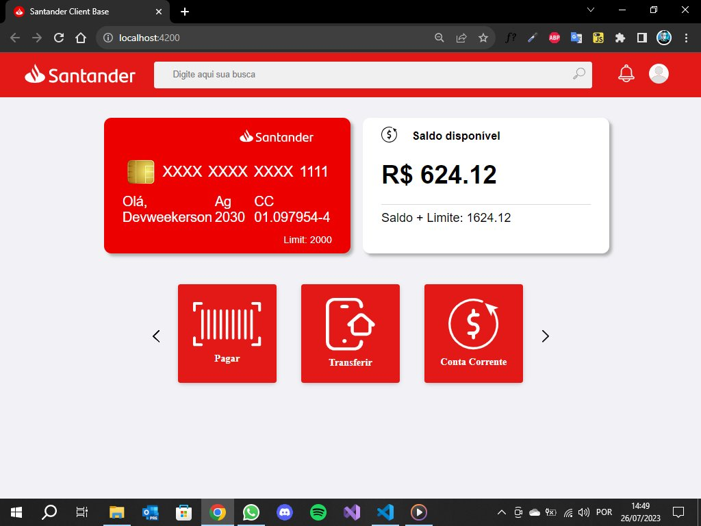

<h1 align="center">
 
   
  Santander Home Clone - Angular
</h1>

This project was generated with [Angular CLI](https://github.com/angular/angular-cli) version 16.1.5.

## Technologies & Techniques

This project was developed with the following technologies:

](https://img.shields.io/badge/Angular-DD0031?style=for-the-badge&logo=angular&logoColor=white)

## Development server

Run `ng serve` for a dev server. Navigate to `http://localhost:4200/`. The application will automatically reload if you change any of the source files.

## Code scaffolding

Run `ng generate component component-name` to generate a new component. You can also use `ng generate directive|pipe|service|class|guard|interface|enum|module`.

## Build

Run `ng build` to build the project. The build artifacts will be stored in the `dist/` directory.

## Running unit tests

Run `ng test` to execute the unit tests via [Karma](https://karma-runner.github.io).

## Running end-to-end tests

Run `ng e2e` to execute the end-to-end tests via a platform of your choice. To use this command, you need to first add a package that implements end-to-end testing capabilities.

## Further help

To get more help on the Angular CLI use `ng help` or go check out the [Angular CLI Overview and Command Reference](https://angular.io/cli) page.

## Autor

|       [ Marcelo Junior](https://github.com/designtechti490)        |
| :----------------------------------------------------------------------------------------------------------------------------------------------------: |
| ](https://img.shields.io/badge/LinkedIn-0077B5?style=for-the-badge&logo=linkedin&logoColor=white) |

---

⌨️ com 💙 por [Design Tech TI](https://github.com/designtechti490)
